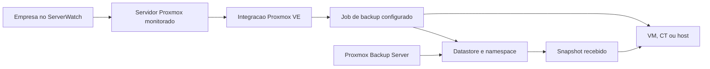

# Integracao com Proxmox Backup Server

Este documento define o plano de implementacao do monitoramento de backups do
Proxmox VE e Proxmox Backup Server no ServerWatch.

O objetivo e adicionar o Proxmox como um novo provedor de backups sem remover
ou alterar o funcionamento atual da integracao com o MSP Cloud Backup Pro.

## Objetivos

- cadastrar um ou mais Proxmox Backup Servers;
- cadastrar os ambientes Proxmox VE que enviam backups para cada PBS;
- importar os jobs configurados nos Proxmox VE;
- confirmar no PBS se os backups realmente foram recebidos;
- relacionar jobs e snapshots com VMs, containers e hosts monitorados;
- herdar automaticamente a empresa do virtualizador Proxmox correspondente;
- exibir sucesso, alerta, atraso, erro, verificacao e armazenamento;
- permitir alternar a pagina de backups entre visao consolidada, MSP Cloud
  Backup Pro e Proxmox Backup Server;
- manter o controle de acesso por empresa ja aplicado no ServerWatch.

## Decisao de arquitetura

O monitoramento deve consultar duas fontes:

1. **Proxmox VE**
   - informa os jobs configurados;
   - informa agenda, estado habilitado, datastore, namespace e convidados;
   - permite detectar jobs configurados que nunca produziram um backup.

2. **Proxmox Backup Server**
   - informa snapshots realmente armazenados;
   - informa tamanho, horario, owner, datastore, namespace e verificacao;
   - informa tarefas de backup, prune, garbage collection e verify.

Consultar apenas o PBS nao e suficiente para identificar um job configurado
que nunca executou. Consultar apenas o PVE nao confirma que o snapshot chegou
e continua valido no armazenamento.

O ServerWatch continuara responsavel por:

- executar a coleta periodica;
- normalizar os dados dos provedores;
- aplicar regras de status;
- persistir o ultimo estado e o historico relevante;
- aplicar o escopo de empresas;
- apresentar os dados no frontend.

## Fluxo de associacao e heranca



Regra principal de heranca:

```text
Empresa do backup = empresa do servidor Proxmox VE de origem
```

O cadastro de um PVE deve apontar para um servidor existente no inventario do
ServerWatch, preferencialmente marcado como `Virtualizador / Proxmox`.

Quando o PVE estiver vinculado a uma empresa:

- todos os jobs importados desse PVE herdam a mesma empresa;
- snapshots relacionados aos jobs herdam a mesma empresa;
- VMs e containers encontrados podem ser relacionados aos servidores ja
  cadastrados;
- a troca da empresa do PVE deve atualizar os registros derivados.

O PBS pode atender varios clientes. Portanto, a empresa nao deve ser herdada
diretamente do PBS. Ela deve vir do PVE de origem.

## Identificacao de jobs e snapshots

O relacionamento nao deve depender apenas do nome exibido.

Chave recomendada:

```text
pbs_id
datastore
namespace
backup_type
backup_id
pve_source_id
```

Campos importantes:

- `backup_type`: `vm`, `ct` ou `host`;
- `backup_id`: normalmente o VMID ou identificador do host;
- `namespace`: separa clientes e origens dentro do mesmo datastore;
- `datastore`: identifica o armazenamento no PBS;
- `pve_source_id`: identifica de qual Proxmox VE veio a configuracao.

Quando varios Proxmox utilizarem VMIDs iguais, o `namespace` e o
`pve_source_id` evitam associacoes incorretas.

## Modelo de dados proposto

Na primeira fase, os dados podem continuar dentro do documento de estado atual
do MongoDB. A separacao em colecoes pode ser feita futuramente, sem bloquear a
integracao.

### Provedor de backup

```json
{
  "id": "provider-pbs-insideti",
  "type": "proxmox",
  "name": "PBS Inside TI",
  "enabled": true,
  "createdAt": "2026-06-20T12:00:00.000Z",
  "updatedAt": "2026-06-20T12:00:00.000Z"
}
```

### Proxmox Backup Server

```json
{
  "id": "pbs-insideti",
  "providerId": "provider-pbs-insideti",
  "name": "PBS Inside TI",
  "baseUrl": "https://pbs.exemplo.local:8007",
  "tokenId": "serverwatch@pbs!monitor",
  "tokenSecretEncrypted": "valor-protegido",
  "tlsFingerprint": "AA:BB:CC:DD",
  "verifyTls": true,
  "enabled": true,
  "lastSyncAt": null,
  "lastSyncStatus": "pending",
  "lastError": null
}
```

### Fonte Proxmox VE

```json
{
  "id": "pve-cliente-a",
  "pbsId": "pbs-insideti",
  "serverId": "servidor-proxmox-no-serverwatch",
  "name": "PVE Cliente A",
  "baseUrl": "https://pve.cliente.local:8006",
  "tokenId": "serverwatch@pve!monitor",
  "tokenSecretEncrypted": "valor-protegido",
  "tlsFingerprint": "11:22:33:44",
  "verifyTls": true,
  "datastore": "backup-clientes",
  "namespace": "cliente-a",
  "groupId": "empresa-cliente-a",
  "enabled": true
}
```

O campo `groupId` deve ser derivado do `serverId` sempre que possivel, evitando
duas fontes de verdade.

### Job normalizado

```json
{
  "id": "pve-cliente-a:job-01",
  "provider": "proxmox",
  "pveSourceId": "pve-cliente-a",
  "pbsId": "pbs-insideti",
  "groupId": "empresa-cliente-a",
  "jobId": "job-01",
  "enabled": true,
  "schedule": "daily",
  "datastore": "backup-clientes",
  "namespace": "cliente-a",
  "selection": {
    "mode": "include",
    "guests": ["100", "101"]
  },
  "expectedWindowMinutes": 1560,
  "lastRunAt": null,
  "lastSuccessAt": null,
  "status": "pending"
}
```

### Backup normalizado por convidado

```json
{
  "id": "pbs-insideti:backup-clientes:cliente-a:vm:100",
  "provider": "proxmox",
  "pbsId": "pbs-insideti",
  "pveSourceId": "pve-cliente-a",
  "groupId": "empresa-cliente-a",
  "serverId": "servidor-vm-100-no-serverwatch",
  "datastore": "backup-clientes",
  "namespace": "cliente-a",
  "backupType": "vm",
  "backupId": "100",
  "displayName": "SRV-APP",
  "lastSnapshotAt": "2026-06-20T02:00:00.000Z",
  "lastSuccessAt": "2026-06-20T02:00:00.000Z",
  "lastVerifyAt": "2026-06-20T05:00:00.000Z",
  "verifyStatus": "ok",
  "sizeBytes": 107374182400,
  "status": "success",
  "reason": null
}
```

## Camada de provedores

O modulo atual usa diretamente o nome `cloudBackup`. Antes de adicionar o PBS,
deve ser criada uma camada normalizada:

```text
services/backups/
  index.js
  status.js
  providers/
    mspCloud.js
    proxmox.js
```

Contrato sugerido:

```js
export async function refreshProvider(config) {}
export function normalizeProviderState(raw) {}
export function getProviderSummary(state, user) {}
```

Estado exposto ao frontend:

```json
{
  "configured": true,
  "activeProvider": "all",
  "providers": {
    "msp": {},
    "proxmox": {}
  },
  "summary": {
    "monitored": 0,
    "success": 0,
    "warning": 0,
    "error": 0,
    "unmonitored": 0
  }
}
```

Durante a migracao, o backend deve continuar preenchendo o contrato antigo
`cloudBackup` ate que todas as telas tenham sido adaptadas.

## Endpoints externos consultados

Os caminhos exatos devem ser validados contra as versoes de PVE e PBS usadas
no ambiente.

### Proxmox Backup Server

Base:

```text
https://PBS:8007/api2/json
```

Consultas previstas:

```text
GET /version
GET /admin/datastore
GET /admin/datastore/{store}/snapshots
GET /nodes/localhost/tasks
GET /nodes/localhost/tasks/{upid}/status
```

### Proxmox VE

Base:

```text
https://PVE:8006/api2/json
```

Consultas previstas:

```text
GET /version
GET /cluster/backup
GET /cluster/resources
GET /nodes
GET /nodes/{node}/tasks
GET /nodes/{node}/tasks/{upid}/status
```

O coletor deve usar paginacao e filtros quando disponiveis para evitar carregar
todo o historico a cada sincronizacao.

## Autenticacao e seguranca

Usar API Tokens exclusivos e somente leitura.

Cabecalho PBS:

```text
Authorization: PBSAPIToken=usuario@realm!token-id:segredo
```

Cabecalho PVE:

```text
Authorization: PVEAPIToken=usuario@realm!token-id=segredo
```

Requisitos:

- nunca enviar tokens ao frontend;
- nunca gravar segredos em logs;
- proteger os segredos persistidos;
- permitir revogar e substituir tokens;
- validar certificado TLS ou fingerprint configurado;
- bloquear URLs locais inseguras quando nao autorizadas;
- aplicar timeout e limite de resposta;
- nao permitir que usuarios comuns alterem integracoes;
- registrar auditoria de criacao, alteracao, teste e remocao.

Permissoes minimas devem ser testadas em ambiente controlado. Como ponto de
partida:

- PBS: auditoria de datastore e leitura de tarefas;
- PVE: auditoria de jobs, recursos e tarefas.

## Regras de status

### Sucesso

- job habilitado;
- snapshot correspondente encontrado;
- ultimo resultado concluido com sucesso;
- snapshot dentro da janela esperada.

### Alerta

- backup ainda dentro da tolerancia, mas proximo do limite;
- ultima verificacao ausente ou antiga;
- job parcialmente correspondente;
- datastore acima do limite de ocupacao;
- coleta temporariamente indisponivel, mantendo o ultimo estado conhecido.

### Erro

- ultima tarefa terminou com erro;
- snapshot nao foi criado apos a janela esperada;
- verificacao do snapshot falhou;
- job existe, mas nao ha snapshot correspondente;
- PBS ou datastore informa falha operacional.

### Sem monitoramento

- job desabilitado;
- job explicitamente ignorado;
- fonte PVE desativada;
- convidado excluido da politica de monitoramento.

### Sem dados

- integracao ainda nao sincronizou;
- credencial invalida;
- PVE/PBS inacessivel;
- relacionamento ainda nao configurado.

Um erro de coleta nao deve transformar automaticamente backups saudaveis em
erro. A interface deve diferenciar:

```text
Backup com erro
Coleta sem contato
```

## Janela esperada

O sistema deve calcular quando um backup passa a ser considerado atrasado.

Ordem de preferencia:

1. proxima execucao derivada da agenda do job;
2. intervalo historico observado;
3. tolerancia configurada manualmente.

Configuracao inicial sugerida:

```text
diario: 26 horas
semanal: 8 dias
mensal: 35 dias
tolerancia adicional configuravel: 0 a 24 horas
```

## API interna do ServerWatch

Rotas administrativas propostas:

```text
GET    /api/backups/providers
POST   /api/backups/providers/proxmox
PATCH  /api/backups/providers/proxmox/:id
DELETE /api/backups/providers/proxmox/:id
POST   /api/backups/providers/proxmox/:id/test
POST   /api/backups/providers/proxmox/:id/refresh

POST   /api/backups/providers/proxmox/:id/pve-sources
PATCH  /api/backups/providers/proxmox/:id/pve-sources/:sourceId
DELETE /api/backups/providers/proxmox/:id/pve-sources/:sourceId
POST   /api/backups/providers/proxmox/:id/pve-sources/:sourceId/test
```

Rotas de leitura:

```text
GET /api/backups?provider=all
GET /api/backups?provider=msp
GET /api/backups?provider=proxmox
GET /api/backups/proxmox/clients
GET /api/backups/proxmox/jobs
GET /api/backups/proxmox/snapshots
```

Todas as respostas devem ser filtradas pelas empresas permitidas ao usuario.

## Interface

### Seletor de provedor

Adicionar no topo da pagina `Backups` um controle segmentado:

```text
Visao geral | MSP Cloud Backup Pro | Proxmox Backup Server
```

Comportamento:

- `Visao geral`: consolida indicadores dos dois provedores;
- `MSP Cloud Backup Pro`: preserva a tela atual;
- `Proxmox Backup Server`: exibe dados de PVE/PBS;
- manter a selecao durante a sessao;
- ocultar provedores nao configurados apenas quando isso nao impedir o
  administrador de cadastra-los.

### Visao Proxmox

Widgets principais:

- jobs monitorados;
- sucesso;
- atraso/alerta;
- erro;
- sem monitoramento;
- coleta PVE/PBS;
- capacidade dos datastores;
- snapshots sem job correspondente;
- jobs sem snapshot correspondente;
- verificacoes com falha.

Listas:

- empresas;
- Proxmox VE;
- jobs;
- VMs e containers;
- datastores;
- snapshots;
- tarefas recentes.

### Detalhe da empresa

Ao abrir uma empresa:

- consolidar MSP e Proxmox na visao geral;
- permitir filtrar pelo provedor;
- exibir taxa de sucesso apenas sobre backups monitorados;
- exibir sem monitoramento separadamente;
- mostrar quais PVEs e PBS atendem a empresa;
- permitir abrir o job, convidado, snapshot e tarefa relacionada.

### Pagina Servidores

No widget de backup da empresa:

- consolidar os provedores na visao padrao;
- mostrar a origem de cada indicador;
- permitir abrir a pagina de backups ja filtrada pela empresa e provedor;
- mostrar backup da VM no detalhe do servidor quando houver associacao.

### Administracao

Adicionar uma area `Integracoes de backup` contendo:

- cadastro do PBS;
- teste de conexao;
- cadastro dos PVE sources;
- selecao do servidor Proxmox do inventario;
- datastore e namespace;
- intervalo de sincronizacao;
- tolerancia;
- estado da ultima coleta;
- erro sanitizado;
- botao de atualizacao manual.

## Sincronizacao

Fluxo recomendado:

1. validar conexao com o PBS;
2. listar datastores e namespaces;
3. consultar PVE sources habilitados;
4. importar jobs configurados;
5. importar recursos e nomes de VMs/CTs;
6. consultar snapshots e tarefas recentes no PBS;
7. relacionar jobs, convidados e snapshots;
8. calcular status;
9. persistir o snapshot normalizado;
10. gerar eventos apenas quando houver mudanca real;
11. atualizar o frontend em tempo real.

Intervalo inicial:

```text
sincronizacao normal: 5 minutos
sincronizacao manual: sob demanda
historico de tarefas: ultimas 24 a 72 horas
```

Aplicar:

- trava para impedir duas sincronizacoes simultaneas;
- timeout por servidor;
- retentativa com backoff;
- cache do ultimo resultado valido;
- atualizacao parcial quando apenas uma fonte falhar;
- limite de concorrencia para ambientes com varios clientes.

## Eventos e alertas

Eventos propostos:

```text
backup_proxmox_success
backup_proxmox_warning
backup_proxmox_failed
backup_proxmox_overdue
backup_proxmox_verify_failed
backup_proxmox_collection_lost
backup_proxmox_collection_recovered
backup_proxmox_datastore_warning
backup_proxmox_datastore_critical
```

Evitar alertas repetidos:

- abrir alerta apenas na transicao para problema;
- atualizar o mesmo alerta enquanto o problema persistir;
- fechar na recuperacao;
- nao reabrir por pequenas variacoes de horario;
- permitir silenciar jobs desativados ou em manutencao.

## Fases de implementacao

### Fase 0 - Validacao tecnica

- criar tokens somente leitura no PVE e PBS de teste;
- registrar versoes do PVE e PBS;
- validar endpoints e payloads reais;
- testar certificado/fingerprint;
- confirmar como jobs apontam para datastore e namespace;
- coletar amostras de sucesso, falha e job nunca executado.

Entrega:

- script de diagnostico que consulta PVE/PBS e salva payloads sanitizados;
- matriz de endpoints e permissoes.

### Fase 1 - Camada multiprovedor

- extrair a integracao MSP para um adaptador;
- criar contrato normalizado;
- manter compatibilidade com `cloudBackup`;
- adicionar filtro `provider`;
- criar testes das regras de agregacao.

Entrega:

- MSP funcionando sem regressao;
- backend preparado para Proxmox.

### Fase 2 - Cadastro e conectividade

- criar modelo de PBS;
- criar modelo de PVE source;
- adicionar armazenamento seguro de tokens;
- implementar testar conexao;
- implementar CRUD administrativo;
- validar heranca de empresa pelo servidor PVE.

Entrega:

- PBS e PVE cadastrados, testados e persistidos.

### Fase 3 - Coleta e correlacao

- coletar jobs do PVE;
- coletar recursos VM/CT;
- coletar snapshots e tarefas do PBS;
- relacionar datastore, namespace, tipo e backup ID;
- calcular status e janela esperada;
- persistir ultimo estado valido.

Entrega:

- dados Proxmox normalizados disponiveis na API interna.

### Fase 4 - Frontend Proxmox

- adicionar seletor de provedor;
- preservar visual MSP;
- criar dashboard PBS/PVE;
- criar detalhe por empresa;
- criar detalhe por job e convidado;
- incluir widget no detalhe de servidor e empresa;
- preservar alinhamento, altura e rolagem dos paineis.

Entrega:

- monitoramento Proxmox utilizavel pela interface.

### Fase 5 - Alertas e historico

- gerar eventos por transicao;
- integrar notificacoes;
- adicionar filtros por provedor;
- adicionar recuperacao automatica;
- adicionar limites de datastore;
- adicionar falha de verificacao.

Entrega:

- operacao diaria com alertas confiaveis.

### Fase 6 - Escala e endurecimento

- limitar concorrencia;
- adicionar metricas da sincronizacao;
- revisar indices e tamanho do estado MongoDB;
- separar colecoes se o volume exigir;
- adicionar retencao de historico;
- documentar backup e restauracao das configuracoes;
- testar dezenas de PVE sources no mesmo PBS.

Entrega:

- modulo pronto para crescimento controlado.

## Testes obrigatorios

### Unitarios

- normalizacao de respostas PVE/PBS;
- calculo da janela esperada;
- status de sucesso, alerta, erro e sem monitoramento;
- consolidacao MSP + Proxmox;
- filtro por empresa;
- correlacao com namespace e VMID duplicado;
- erro de coleta sem sobrescrever ultimo estado valido.

### Integracao

- token valido e invalido;
- certificado valido, fingerprint e certificado recusado;
- PBS com varios datastores;
- um PBS atendendo varias empresas;
- PVE sem jobs;
- job sem snapshot;
- snapshot sem job;
- tarefa com erro;
- verificacao com falha;
- datastore indisponivel;
- timeout parcial de um PVE source.

### Interface

- alternancia entre provedores;
- visao consolidada;
- usuario com uma empresa;
- usuario com varias empresas;
- administrador;
- cards sem overflow;
- listas com rolagem preservada;
- atualizacao manual;
- estados vazios e erro de coleta;
- tema claro e escuro;
- desktop e mobile.

## Criterios de aceite

A primeira versao pode ser considerada pronta quando:

- o MSP Cloud Backup Pro continua funcionando sem regressao;
- o administrador cadastra um PBS e um ou mais PVEs;
- os jobs configurados aparecem automaticamente;
- cada job herda a empresa do PVE correto;
- snapshots sao relacionados sem conflito entre clientes;
- jobs sem snapshot aparecem como problema;
- usuarios veem somente empresas permitidas;
- o seletor alterna entre visao geral, MSP e Proxmox;
- o detalhe da empresa mostra os dois provedores;
- o detalhe do servidor mostra seu backup Proxmox quando relacionado;
- erros de coleta sao diferentes de erros de backup;
- alertas nao duplicam durante o mesmo incidente;
- tokens nunca aparecem no frontend ou logs.

## Riscos e mitigacoes

### Versoes diferentes de PVE/PBS

Mitigacao:

- validar `/version`;
- manter adaptadores tolerantes a campos opcionais;
- registrar versoes testadas.

### VMIDs repetidos

Mitigacao:

- usar PVE source, datastore e namespace na chave.

### Certificados internos

Mitigacao:

- suportar CA confiavel ou fingerprint;
- nao usar `rejectUnauthorized: false` globalmente.

### Grande volume de snapshots

Mitigacao:

- consultar apenas janelas necessarias;
- usar paginacao e filtros;
- persistir agregados e ultimo estado;
- evitar armazenar manifestos e arquivos de backup.

### Empresa incorreta

Mitigacao:

- empresa sempre derivada do PVE source;
- exibir origem da associacao;
- alertar PVE sem empresa;
- impedir heranca direta pelo nome do cliente.

## Ordem recomendada

1. Validar endpoints reais no PBS e em um PVE de teste.
2. Criar a camada multiprovedor mantendo MSP intacto.
3. Implementar cadastro seguro de PBS/PVE.
4. Implementar coleta e correlacao.
5. Adicionar seletor e tela Proxmox.
6. Integrar widgets de empresa e servidor.
7. Adicionar alertas e historico.
8. Testar escala antes de cadastrar todos os clientes.

## Referencias oficiais

- PBS API Viewer: https://pbs.proxmox.com/docs/api-viewer/index.html
- PBS User Management: https://pbs.proxmox.com/docs/user-management.html
- PBS Storage and Namespaces: https://pbs.proxmox.com/docs/storage.html
- PVE API Viewer: https://pve.proxmox.com/pve-docs/api-viewer/index.html

