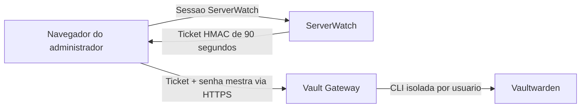

# Integracao nativa com Vaultwarden

## Objetivo

O ServerWatch apresenta uma interface propria para consultar e manter credenciais, enquanto o Vaultwarden continua sendo a fonte unica dos segredos.

## Arquitetura

- A senha mestra nunca passa pelo backend, MongoDB ou Redis do ServerWatch.
- Cada usuario do ServerWatch possui um perfil Bitwarden CLI isolado no gateway.
- A chave de sessao descriptografada permanece somente na memoria do gateway.
- A sessao bloqueia apos 10 minutos sem uso e expira em no maximo 60 minutos.
- Client ID e Client Secret sao usados somente na primeira vinculacao e ficam no perfil cifrado mantido pela CLI.
- Operacoes sensiveis geram auditoria apenas com usuario, acao, item e resultado; nenhum segredo e registrado.

## Primeira vinculacao

1. No Vaultwarden, abra **Configuracoes > Seguranca > Chaves** e gere uma chave de API pessoal. O Client ID deve iniciar por `user.`. A chave da organizacao (`organization.`) pertence a Public API administrativa e nao permite autenticar/descriptografar itens do cofre.
2. No ServerWatch, acesse **Cofre** pelo endereco HTTPS.
3. Informe Client ID, Client Secret e a senha mestra.
4. Depois da vinculacao, os proximos acessos solicitam somente a senha mestra.

## Compatibilidade

O Vaultwarden permanece fixado em 1.37.0. O gateway utiliza temporariamente Bitwarden CLI 2026.6.0, pois a versao 2026.7.0 ainda pode apresentar falha de desserializacao WASM ao listar itens. Atualize o CLI apenas depois de validar listagem, leitura e gravacao em homologacao.

## Modelo de vinculo

O gateway grava os identificadores da empresa e do servidor em campos personalizados do item:

- `ServerWatch.CompanyId`
- `ServerWatch.Company`
- `ServerWatch.ServerId`
- `ServerWatch.Server`

## Seguranca operacional

- O cofre fica disponivel apenas para administradores.
- CORS aceita somente `https://painel.grupoinsideti.com.br`.
- O Vaultwarden volta a impedir incorporacao por iframe (`frame-ancestors 'none'`).
- Respostas do gateway usam `Cache-Control: no-store`.
- A chave HMAC e injetada por variavel de ambiente nas duas VMs e nao pertence ao repositorio.
